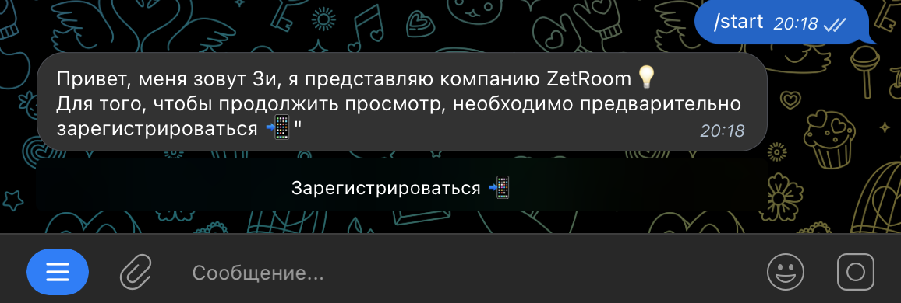
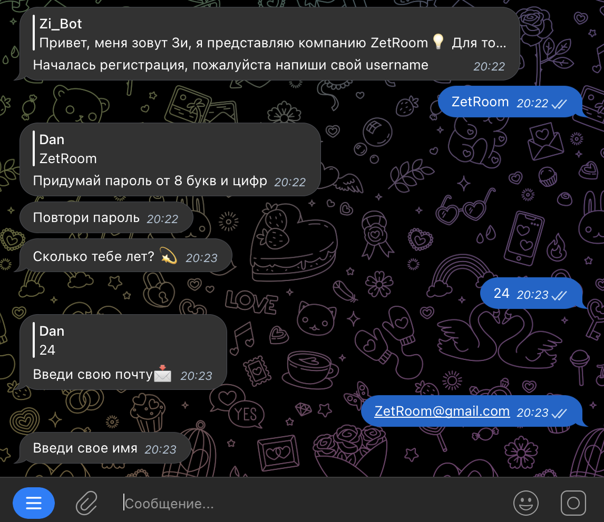
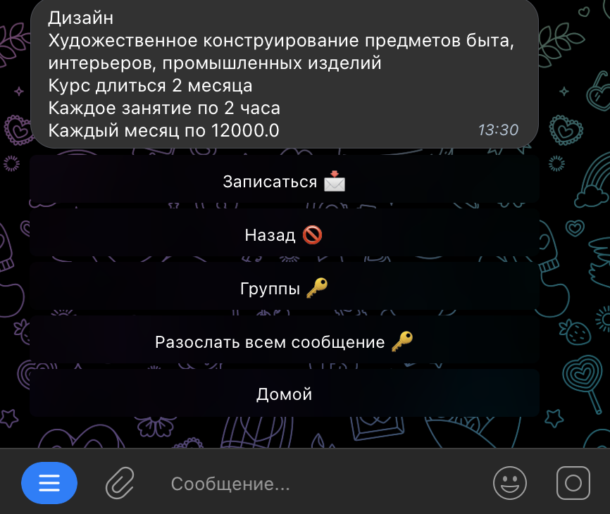
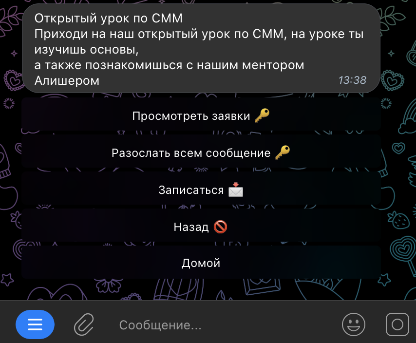
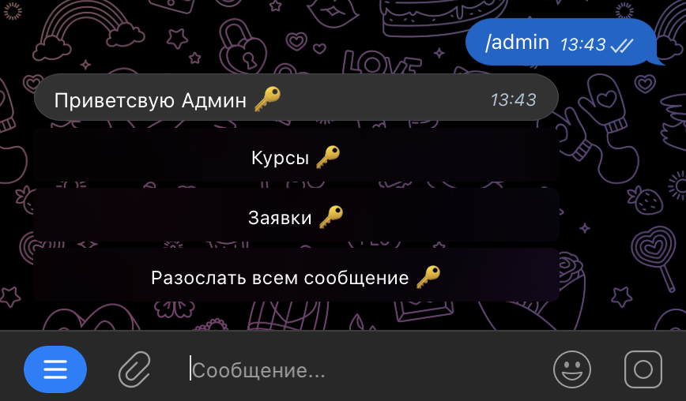

# Zi Bot
Zi bot это специальный бот от компании [Zetroom](https://www.Zetroom.com)

* [Предназначение](#general-info)
* [Регистрация](#technologies)
* [Курсы](#setup)
* [Мероприятия](#setup)
* [Административная часть](#setup)

### Наш бот предназначен для следующих целях

#### Для клиентов
* Предоставлять наши услуги и продукты
* Прием заявок на курсы
* Прием заявок на мероприятия
* Регистрация (Нужна для сбора информаций от клиента)
* Разные посхалки для получение промокодок (функция в разработке)

#### Административная часть
* Рассылка сообщений определенным группам людей
* Просмотр заявок
* Просмотр каждого студента
* Распределение студентов по группе
* Принятия либо отказа заявки на определенный курс

## Регистрация

После запуска самого бота, бот высылает привествующее сообщение и кнопка регистрации

После регистрации пользователя встречает сообщение с несколькими кнопками

## Курсы 💻
После нажатии этой кнопки у пользователя появляется о актуальных курсов. А также кнопки с их названиями.

## Административная часть
Для доступа административной части вам нужно написать команду /admin чтобы использовать инструменты админа
Первый и самый главный инструмент это рассылка. Этот инструмент находится в разных разделов, например если админ
зайдет в раздел курсы, то он может рассматривать группы по этому курсу а также разослать всем сообщение
в добавок он может посмотреть каждого студента и отправить ему сообщение через бота
а также рассылка возможно для тех кто оставил заявку в мероприятие

